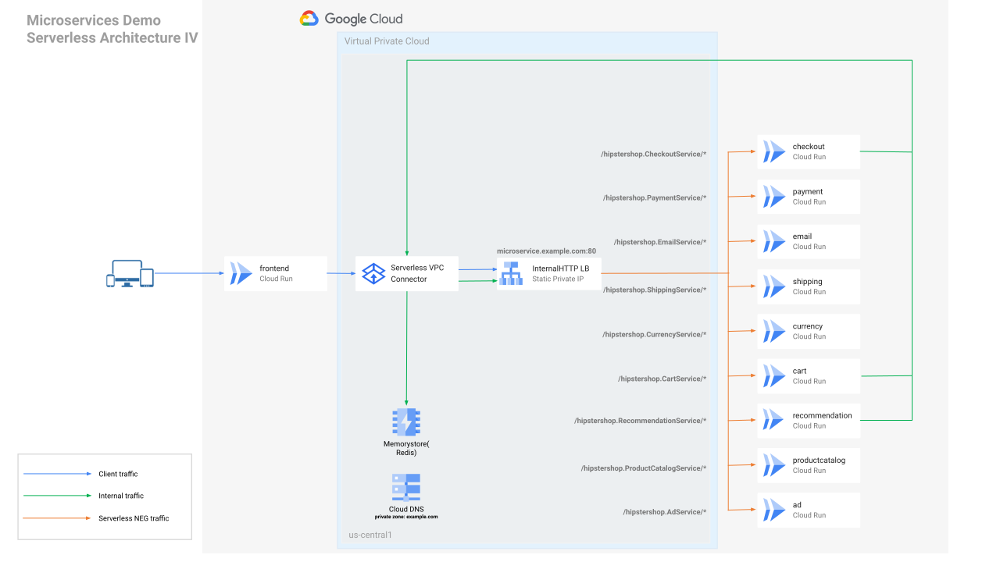

# Google Cloud Run with Pulumi

[](https://codespaces.new/usrbinkat/pulumi-iac-gcp-cloud-run?quickstart=1&devcontainer_path=.devcontainer%2Fextra%2Fdevcontainer.json)

[]() [](https://www.pulumi.com/docs/get-started/install/)

## Powered by Pulumi + Devcontainers

The Pulumi [Devcontainer](https://code.visualstudio.com/docs/devcontainers/containers) is designed with deep [VS Code](https://code.visualstudio.com) and [Github Codespaces](https://github.com/features/codespaces) integration to streamline common Pulumi IaC development environments.

# Getting Started

- [Pulumi Dev Container](#pulumi-dev-container)
- [Getting Started](#getting-started)
- [Github CodeSpaces](#github-codespaces)
  - [First time setup](#first-time-setup)
- [VS Code Dev Container](#vs-code-dev-container)
- [Git Submodule](#git-submodule)

# Dev Environment

## Github Codespaces

[](https://codespaces.new/pulumi/devcontainer?quickstart=1)

Codespaces is the easiest way to get started quickly. Simply click the button above to open this repository in a new Codespace and then follow the [First time setup](#first-time-setup) instructions below.

## VSCode Devcontainer

To use this repo with VSCode in a local Devcontainer with Docker, clone this repository and open in VSCode, follow prompts on screen to open in the Devcontainer.

To use the Dev Container in VS Code, you will need to install the [Remote - Containers](https://marketplace.visualstudio.com/items?itemName=ms-vscode-remote.remote-containers) extension, and follow the [official tutorial here](https://code.visualstudio.com/docs/devcontainers/tutorial) to begin.

## Local Environment

Alternatively, use this IaC repository locally as is and maintain your dependencies according to your own preferences and requirements.

Once your IaC and dependencies are met, proceed to [Setup](#setup).

## Setup

1. Pulumi Login

```bash
pulumi login
```

2. Create a new stack

```bash
pulumi stack select --create --stack workshop-cloudrun
```

# Git Submodule

The pulumi Dev Container repository can be added as a submodule to an existing project to provide an easy and consistent development environment that is maintained upstream.

To add this repository as a submodule to your project, run the following commands:

```bash
git submodule add https://github.com/pulumi/devcontainer .github/devcontainer
git submodule update --init --recursive .github/devcontainer
mkdir -p .devcontainer
rsync -av .github/devcontainer/devcontainer/* .devcontainer
```

To update the devcontainer submodule in consuming repos:

```bash
git submodule update --remote --merge .github/devcontainer
rsync -av .github/devcontainer/devcontainer/* .devcontainer
```

After the submodule is added, you can open your project in VS Code and it will automatically detect the Dev Container configuration and prompt you to open the project in a container, or you can open the project in Github CodeSpaces.

# References

Demo code based on original work by [@xiangshen-dk](https://github.com/xiangshen-dk) from [github.com/shenxiang-demo/microservices-demo/.../serverless/pulumi](https://github.com/shenxiang-demo/microservices-demo/tree/pulumi-cloudrun-one-ilb/serverless/pulumi)
## Overview
This document describes building and deploying the microservices demo application(`Online Boutique`) to Cloud Run.

Some objectives:

- Minimize code changes.
- Ensure the internal microservices are private and keep the network traffic inside the Google network (serverless VPC connectors will be used).
- Redis cache will be deployed to [Memorystore(Redis)](https://cloud.google.com/memorystore/docs/redis).
- Use Infrastructure-as-code([Pulumi](https://www.pulumi.com/)) to deploy the solution.

## Architecture after deployment



## Clone the repository

```
git clone -b pulumi-cloudrun-one-ilb https://github.com/shenxiang-demo/microservices-demo.git
```

## Install pulumi

```
cd microservices-demo/serverless/pulumi
npm install
curl -fsSL https://get.pulumi.com | sh
export PATH=$PATH:$HOME/.pulumi/bin
```

## Config project

```
export PROJECT_ID=<YOUR GCP PROJECT ID>
gcloud config set project $PROJECT_ID
gcloud auth application-default login
gcloud auth configure-docker
```

## Create a bucket as a Pulumi [backend](https://www.pulumi.com/docs/intro/concepts/state/#logging-into-the-google-cloud-storage-backend)

```
gsutil mb gs://pulumi-${PROJECT_ID}

pulumi login gs://pulumi-${PROJECT_ID}
```

## Create a new dev stack
```
pulumi stack init dev

pulumi config set gcp:project $PROJECT_ID
```
You can press `return` to skip the passphrase.

## Install Pulumi NPM Dependencies

```bash
npm install
```

## Create the stack
```
pulumi up -y
```

By default, the service deployments will use the container images listed in the [release/kubernetes-manifests.yaml](../../release/kubernetes-manifests.yaml) file.

If you want to build the container images from the source code, you can set the flag `build_image_from_src` to true using the following command:

```
pulumi config set build_image_from_src true
```

__Note:__ However, this step will __NOT__ work in CloudShell since CloudShell doesn't have sufficient disk space to build all the container images.

## Clean up

If you don't want to delete the whole project, run the following command to delete the resources:

```
pulumi destroy -y
```
